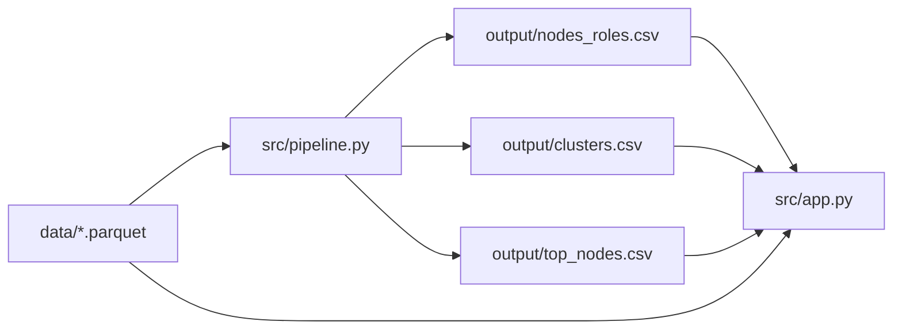

# Граф денег

Локальная панель для изучения направленных переводов и аналитических признаков. Роль и приоритет — это **признаки и гипотеза для проверки**, они не доказывают виновность.

## Установка и запуск

Из корня репозитория (Python 3.10+):

```bash
python3 -m venv .venv
source .venv/bin/activate       # Windows: .venv\Scripts\activate
python -m pip install -r requirements.txt
python -m src.pipeline
streamlit run src/app.py
```

`python -m src.pipeline` — подтверждённая команда полного пересчёта (ветка `feature/pipeline`, коммит `99c7181`). Она читает три parquet-файла из `data/` и формирует CSV в `output/`. По результатам проверки пайплайна обрабатываются 2 248 узлов и создаются 89 кластеров; полный расчёт занимает около 13,77 секунды на проверенном ноутбуке. Запускайте команду из корня репозитория. Выходные файлы: `nodes_roles.csv`, `clusters.csv`, `top_nodes.csv`.

## Панель

- Топ `output/top_nodes.csv` с рангом, gid, ролью, приоритетом и `why`, включая seed и длину кратчайшего направленного пути (по данным pipeline-коммита `cb7a530`).
- Поиск gid в `output/nodes_roles.csv` и карточка с ролью, `role_score`, `priority_score`, кластером и `evidence`.
- Направленная окрестность из `data/edges.parquet`, стрелки идут от `src` к `dst`, цвет узла соответствует роли, выбранный узел выделен. Показаны до 80 ближайших рёбер для читаемости.
- Таблицы входящих и исходящих связей с суммами переводов и количеством транзакций (если поля присутствуют).
- Просмотр участников кластера при наличии разметки кластера.

Ожидаемые колонки: `nodes_roles.csv`: `gid`, `role`, `role_score`, `cluster_id`, `priority_score`, `evidence`; `clusters.csv`: `cluster_id`, `n_nodes`, `n_seed`, `sum_kzt_internal`, `top_gids`, `hypothesis`; `top_nodes.csv`: `rank`, `gid`, `role`, `priority_score`, `why`; `edges.parquet`: `src`, `dst`, `sum_kzt`, `n_tx`. `top_gids` — запятый-разделённый список числовых gid в одной CSV-ячейке (например, `"1024,2048,4096"`); стандартный CSV writer берёт такую ячейку в кавычки. Интерфейс проверяет обязательные поля и сообщает, если файл отсутствует, пуст или имеет другую схему.

## Ограничения данных

Текущая реализация пайплайна читает `depth` и сохраняет ребро агрегированно по паре узлов. Входящие потоки неполны, а порог отбора транзакций 5 000 KZT может исключать меньшие переводы. Без эталонной разметки нельзя оценить точность ролей и приоритетов. Всегда формулируйте результат как аналитические признаки и гипотезу для проверки; изучайте первичные операции и контекст.

## Устойчивость сети — результаты проверки пайплайна

Согласно проверке коммита `cb7a530` на 2 248 узлах, после удаления top-5 приоритетных узлов сеть распадается на 389 слабосвязных компонент — на 354 больше исходного числа. У 534 узлов теряется путь от seed. Полный расчёт занял 10,57 секунды на проверенном ноутбуке. Это стресс-сценарий для анализа структуры, а не прогноз последствий реального вмешательства. Подробности seed и кратчайшего направленного пути для каждого узла из top-20 находятся в `output/top_nodes.csv`, поле `why`.

## Схема решения



Подробнее: [solution-schema.md](solution-schema.md).
