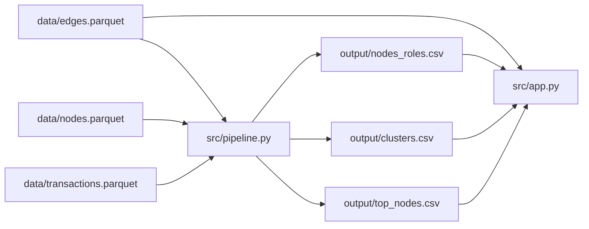

# Схема решения

## Контракт файлов

- `nodes_roles.csv`: `gid`, `role`, `role_score`, `cluster_id`, `priority_score`, `evidence`.
- `clusters.csv`: `cluster_id`, `n_nodes`, `n_seed`, `sum_kzt_internal`, `top_gids`, `hypothesis`.
- `top_nodes.csv`: `rank`, `gid`, `role`, `priority_score`, `why`.
- `top_gids` — CSV-ячейка со списком числовых gid через запятую.
- `edges.parquet`: направленные рёбра `src → dst`, агрегированная сумма `sum_kzt`, число переводов `n_tx`.

Пайплайн строит признаки и шесть эвристических ролей, затем рассчитывает priority score, Louvain-кластеры и объяснения top-20. UI читает артефакты относительно корня проекта, подсвечивает ближайшую окрестность выбранного gid и показывает его карточку и кластерную гипотезу. Граф кластера содержит `top_gids`, поэтому он показывает ключевые узлы, а не гарантированно каждого члена.

Для графа около 1 млн узлов потребуется серверная выборка окрестности с индексом и лимитами вместо отправки полного графа в браузер.
