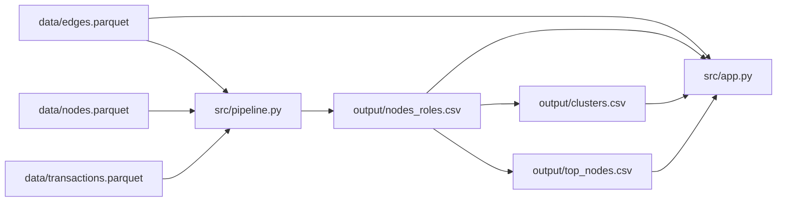

# Схема решения

Пайплайн запускается из корня командой `python -m src.pipeline`, загружает входные parquet и создаёт три CSV-артефакта. `nodes_roles.csv` содержит gid, роль, role score, cluster id, priority score и evidence; `clusters.csv` описывает кластер и содержит строку `top_gids` с ключевыми gid через запятую в одной CSV-ячейке; `top_nodes.csv` задаёт ранжированный список с объяснением `why`, в том числе seed и длину кратчайшего направленного пути. Панель проверяет схему, показывает топ-20, карточку узла, кластерную гипотезу и окрестность из `edges.parquet`.

По переданным результатам проверки коммита `cb7a530`, удаление top-5 дало 389 слабосвязных компонент (+354), а 534 узла потеряли путь от seed; время расчёта — 10,57 с на проверенном ноутбуке. Эти цифры демонстрационные для зафиксированного набора данных и окружения.

Интерфейс предназначен для локального исследования окрестностей. Для масштаба в миллион узлов потребуется индексированный серверный запрос окрестности и ограниченная выдача браузеру вместо загрузки всего графа.
